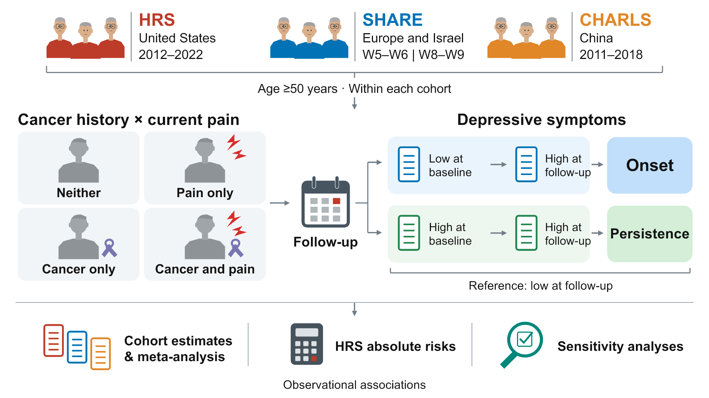
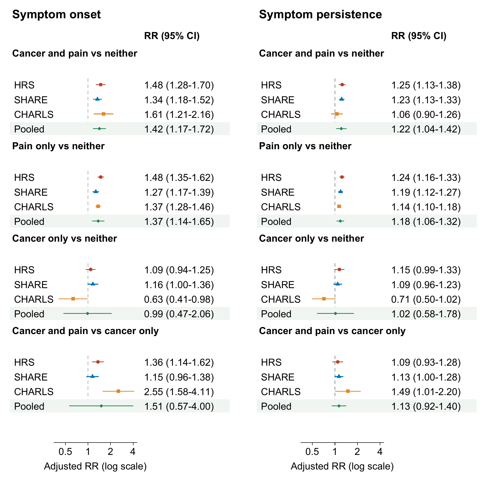
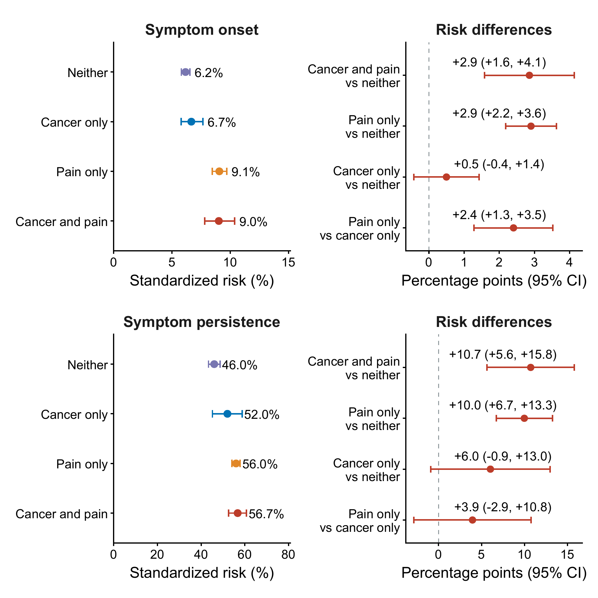
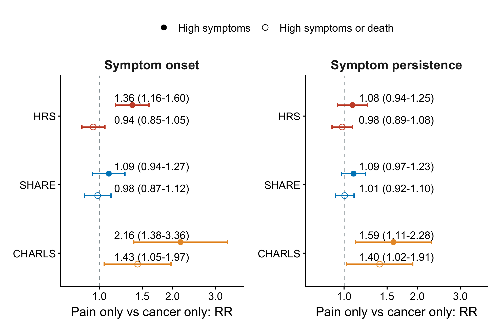
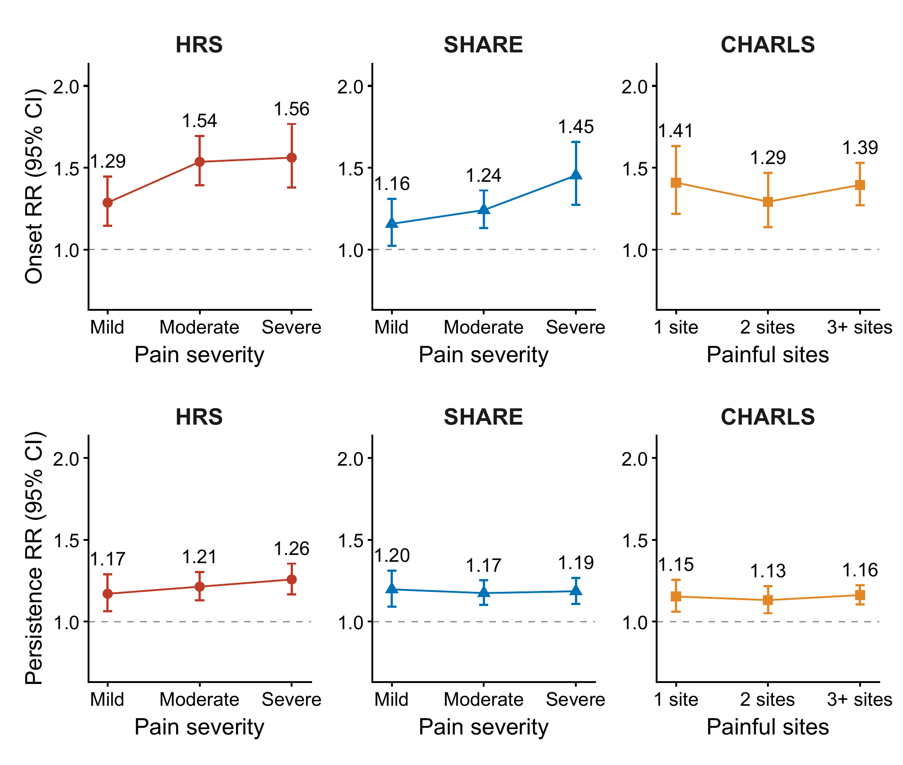

Current pain and cancer history in depressive symptom transitions across three ageing cohorts

Abstract

Background: Cancer history and current pain represent different dimensions of illness burden. Their associations with later depressive symptoms may depend on the baseline symptom state and whether death is included in the outcome.

Aim: To compare cancer-pain phenotypes across depressive-symptom onset and persistence, and assess the limits of symptom-based comparisons when death is included.

Methods: We conducted coordinated prospective analyses of adults aged at least 50 years in HRS, SHARE, and CHARLS. Four baseline phenotypes combined cancer history and current pain. Survey-weighted modified Poisson models estimated next-wave risk ratios (RRs), with random-effects synthesis of prespecified contrasts. Additional sensitivity analyses directly compared pain only with cancer only and examined high symptoms or death. HRS 2022 follow-up symptoms were updated from Final Core. HRS absolute risks used logistic standardization after a probability-boundary check.

Results: Onset models included 141,599 person-intervals and 19,898 events; persistence models included 43,192 intervals and 24,529 events. Cancer and pain versus neither yielded pooled RRs of 1.42 (1.17-1.72) for onset and 1.22 (1.04-1.42) for persistence. Pain-only associations were also positive. In HRS, the direct pain-only versus cancer-only onset RR was 1.36 (1.16-1.60), compared with 0.94 (0.85-1.05) for the onset-population composite. Direct contrasts were less uniform across cohorts and outcomes. SHARE estimates used household-first rather than official PSU clustering.

Conclusion: Current pain marks subsequent depressive-symptom burden among surviving respondents. It does not consistently identify greater risk than cancer history alone when death is included. The findings support assessing pain alongside cancer history, rather than ranking their overall health risks.

Keywords: Cancer history; Pain; Depressive symptoms; Symptom persistence; Ageing; Multicohort study

Core Tip

Current pain was associated with subsequent high depressive symptoms across three ageing cohorts. However, direct comparisons with cancer history alone depended on the symptom transition and outcome definition. When death was included, pain-only versus cancer-only estimates were close to one in HRS and SHARE; CHARLS contrasts remained positive but imprecise in small cancer groups. Symptom-transition associations among survivors should therefore not be generalized to an overall health-risk ranking. Composite analyses also changed weights and samples and did not isolate the effect of survival selection.

Introduction

Cancer care increasingly recognises anxiety and depression as outcomes requiring systematic identification and stepped management [1,2]. A history of cancer identifies a population with diverse psychological needs. In a linked-record study of more than 850,000 cancer survivors, mental-health risk varied substantially by cancer site, prognosis, and time since diagnosis [3]; recent umbrella-review evidence likewise found considerable heterogeneity in pain, depression, and anxiety across cancer populations [4]. A broad cancer-history indicator may therefore provide limited information about subsequent depressive symptoms once current symptoms are considered.

Current pain may help distinguish psychological needs among people with the same broad diagnosis history. Among older adults with gastrointestinal malignancies, moderate-to-severe pain was strongly associated with functional limitation, anxiety, and depression [5]. Across seven cancer types, pain also clustered with fatigue, sleep disturbance, and depression in distinct symptom-burden profiles [6]. These findings describe symptom burden within cancer populations, but do not resolve the prospective comparison with adults without cancer. It remains uncertain whether a simple pain indicator differentiates later psychological states in community-dwelling adults with and without a cancer history.

Longitudinal ageing research already establishes the broader pain–depression association. SHARE data showed graded increases in two-year depression risk across mild, moderate, and severe pain [7]. Coordinated evidence from England and China supported a longitudinal relationship [8], while later analyses found that persistent or worsening pain trajectories predicted incident depressive symptoms in the United Kingdom and the United States [9]. A five-wave CHARLS analysis further suggested that pain burden more consistently preceded later depressive symptoms than the reverse pathway [10]. Less clear is how these associations compare with those for cancer history alone when both exposures are assessed in the same population.

Baseline depressive symptoms also affect the comparison. Onset among people initially below a symptom threshold concerns entry into a high-symptom state; persistence among those already above it concerns failure to leave that state. The two populations differ in baseline risk and symptom history, so their relative estimates need not be similar. In addition, threshold-based associations may partly reflect overlapping somatic content or functional burden. We examined absolute risks, pain-burden gradients, functional adjustment, and scores without the sleep item to assess these concerns.

We therefore conducted coordinated prospective analyses in HRS, SHARE, and CHARLS. Within each cohort, we harmonized four baseline phenotypes—neither cancer nor pain, cancer only, pain only, and cancer with pain—and examined their associations with next-wave onset and persistence of elevated depressive symptoms. The onset estimand and its focal contrasts were prespecified in SAP v1.0; before inspecting persistence-effect estimates, we froze SAP v1.1 defining the expanded estimand and supporting analyses. We hypothesised that adjusted associations for pain-related phenotypes would be reproducible across cohorts and both state transitions, whereas cancer history alone would show a less consistent pattern. We also assessed cancer–pain interaction without assuming that the joint association would exceed the separate associations.

Materials and Methods

Study design and reporting framework

This study used a coordinated multicohort prospective design based on repeated observations from three population-based studies of ageing: the Health and Retirement Study (HRS) in the United States, the Survey of Health, Ageing and Retirement in Europe (SHARE), and the China Health and Retirement Longitudinal Study (CHARLS) [11-13]. The substantive question, exposure definitions, outcome hierarchy, and minimum adjustment set were aligned across cohorts, but each cohort was reconstructed and analysed separately under its own measurement and sampling structure. Individual-level records and survey weights were not pooled across studies. The primary unit of analysis was the person-interval: exposure and baseline covariates were measured at one interview, and depressive symptoms were evaluated at the next eligible interview. Reporting follows the STROBE recommendations for observational cohort studies [18]. Figure 1 summarizes the cohort structure and the two baseline symptom populations.

Data sources products and observation windows

HRS analyses used the RAND HRS Longitudinal File 2022 (Version 1) and RAND Fat Files for 2012-2022. Intervals were 2012-2014, 2014-2016, 2016-2018, 2018-2020 and 2020-2022. For the last follow-up assessment, the eight depressive-symptom items were rebuilt from HRS 2022 Final Core Version 2.0. Baseline variables and earlier intervals were retained from the frozen RAND-based layer; retention weights for the affected risk sets were rebuilt. This was an endpoint update, not wholesale replacement of RAND files. Mortality remained derived from the archived RAND source, not a newly obtained Final Tracker. The 2022 RAND Fat File E.3A retained in the baseline/source framework contains Early Release material; the relevant HRS acknowledgement remains applicable.

SHARE is a multidisciplinary longitudinal study of adults aged 50 years or older and their partners across European countries and Israel. We used Gateway Harmonized SHARE G, based on SHARE Release 9.0.0, together with the corresponding official longitudinal-weight files. The primary intervals were Waves 5-6 and 8-9. Waves 6-8 were reserved for sensitivity analysis because this interval was longer and did not have a directly released pair-specific longitudinal weight. Release documentation and dataset identifiers are available through the SHARE data documentation portal, and registered-user access is provided through the SHARE Research Data Center. Gateway Harmonized SHARE is an ex-post harmonized derivative intended to support cross-study comparison; its variables were checked against the SHARE release documentation, and the SHARE Conditions of Use continued to apply.

CHARLS is a nationally representative longitudinal study of Chinese residents aged 45 years or older. We used the original 2011, 2013, 2015, and 2018 wave files, with Harmonized CHARLS Version D used to support cross-wave mapping. The analysed intervals were 2011-2013, 2013-2015, and 2015-2018. Core variables were checked against the original wave files, labels, release notes, and user guides rather than relying solely on harmonized variables. Official materials and registered-user downloads are available for Wave 1 (2011), Wave 2 (2013), Wave 3 (2015), and Wave 4 (2018). The 2020 wave was not included because the locally archived harmonized product ended in 2018 and incorporating a separately released pandemic-period wave would have changed the measurement and source-version framework.

Participants and person interval construction

Eligible baseline observations were restricted to respondents aged 50 years or older who completed an interview and had ascertainable cancer history, current pain, and depressive-symptom status. The primary estimand concerned onset of elevated depressive symptoms: person-intervals entered this analysis when the baseline symptom score was below the cohort-specific threshold, and the outcome was whether the score crossed the threshold at the next eligible wave. The important secondary estimand concerned persistence: person-intervals entered this analysis when the baseline score was at or above the threshold, and the outcome was whether the score remained at or above the threshold at follow-up. This distinction separated entry into a high-symptom state from failure to leave that state.

Recorded deaths before the subsequent interview were reported as a distinct follow-up state and excluded before modelling non-response among survivors. We did not estimate a competing-risk cumulative incidence; the target estimand was next-wave depressive-symptom transition among people surviving to the follow-up wave. Surviving respondents with no observed follow-up outcome contributed to interval-specific retention models but not to outcome models. Respondents could contribute more than one eligible interval; estimates therefore describe next-wave risk among eligible person-intervals rather than first-ever lifetime incidence or persistence. Respondent identifiers were included in the survey design to account for repeated contributions. A prespecified sensitivity analysis retained only the first eligible interval per respondent.

Cancer pain phenotypes

At each interval baseline, participants were assigned to one of four mutually exclusive phenotypes: neither cancer nor pain, cancer only, pain only, or cancer and pain. Cancer was defined as a harmonized history of physician-diagnosed cancer; the HRS definition excluded non-melanoma skin cancer according to the RAND coding. Pain was defined from the cohort-specific item indicating current pain or being often troubled by pain. The exposure was intentionally based on current pain rather than inferred pain aetiology. Cancer site, stage, treatment, recurrence, and time since diagnosis were not consistently available across the three cohorts, while pain duration and interference were not measured comparably. Accordingly, the exposure is described as any cancer history and current pain, not active cancer, gastrointestinal cancer, chronic pain, cancer pain, or treatment-related pain.

Depressive symptom outcomes

Elevated depressive symptoms were defined using established cohort-specific thresholds: an eight-item Center for Epidemiologic Studies Depression score (CES-D-8) of at least 4 in HRS, a EURO-D score of at least 4 in SHARE, and a ten-item CES-D score (CES-D-10) of at least 10 in CHARLS [14,15]. Baseline depressive-symptom score was included continuously in every adjusted model. The outcomes are termed onset and persistence of elevated depressive symptoms rather than incident or persistent clinical depression because the cohorts did not use a common diagnostic interview.

To assess whether associations were driven by overlapping somatic content, item-level symptom scores were reconstructed and the sleep item was removed from each scale. Reconstructed full scores were required to agree with the released or harmonized score before reduced scores were used. The reduced follow-up score was standardized within cohort and modelled with adjustment for the corresponding standardized baseline score.

Pain burden measures

The primary four-phenotype exposure used a binary pain indicator to maximize comparability. Supporting analyses used the more detailed pain information available within each cohort. HRS and SHARE pain severity was categorized as no, mild, moderate, or severe pain. CHARLS pain burden was categorized by the number of reported painful body sites as none, one, two, or three or more. Because pain severity and painful-site count are not equivalent constructs, these gradients were analysed and interpreted within cohort and were not combined in meta-analysis. Pain-burden models adjusted for cancer history and the common covariate set.

Covariates

The minimum common adjustment set was defined before formal modelling and included age represented by a natural spline with three degrees of freedom, sex, education (three levels), partnered status, continuous baseline depressive-symptom score, number of non-cancer chronic conditions, current smoking, within-interval wealth quintile, and interval indicators. SHARE models additionally included country fixed effects. The non-cancer condition count comprised hypertension, diabetes, chronic lung disease, heart disease, stroke, and arthritis. Body mass index and alcohol use were not included in the common set because their availability and measurement were not sufficiently uniform across waves.

Covariates were selected to address plausible common causes of cancer history, pain, and depressive symptoms while avoiding routine adjustment for variables that could be consequences of pain or illness. Mobility limitations and limitations in activities of daily living were therefore added sequentially only in explanatory secondary models. Attenuation after functional adjustment was not interpreted as a causal mediation effect because exposure, function, and baseline depressive symptoms were measured contemporaneously.

Survey design weighting and attrition

All analyses retained cohort-specific survey structure. HRS models used the interval-baseline response weight multiplied by an interval-specific inverse probability of follow-up observation among survivors and incorporated HRS standard-error strata, half-sample clusters, and respondent identifiers. SHARE primary intervals used the released calibrated pair-specific longitudinal respondent weights and incorporated country strata plus household and respondent clustering. CHARLS 2011-2013 used the released individual longitudinal weight; later intervals used the baseline individual survey weight multiplied by an interval-specific retention factor and incorporated community and respondent clustering.

Retention models were estimated separately by interval among respondents alive at follow-up. Predictors were age, sex, education, partnered status, cancer-pain phenotype, baseline depressive-symptom score, non-cancer comorbidity count, smoking, and wealth. Predicted observation probabilities were bounded at 0.05-0.99; inverse-probability factors were truncated at the interval-specific 1st and 99th percentiles; and final weights were normalized to mean one within interval. Recorded deaths were not modelled as ordinary attrition. Because official SHARE longitudinal weights were highly right-skewed in some intervals, an additional persistence sensitivity analysis trimmed final weights at the 1st and 99th percentiles.

Variance estimation used the with-replacement first-stage approximation without finite-population corrections. Respondent identifiers were listed at a subsequent clustering stage; this did not supply a separate lower-stage variance component under that approximation. For SHARE, the first-stage clusters in the reported models were households rather than the newly obtained official PSUs. Official SHARE PSU and stratum sensitivity was not performed. Household-first clustering may not reproduce the variance under the official sampling design.

Missing data

Follow-up outcomes, cancer history, current pain, and final analysis weights were not imputed. Covariates were multiply imputed separately within each cohort using chained equations with 20 imputations when the extent of missingness justified imputation [16]. The onset analysis used multiple imputation in HRS and CHARLS and complete covariate records in SHARE, where covariate missingness was minimal. The independently specified persistence analysis used 20 imputations in all three cohorts because SHARE wealth missingness exceeded 1%. Complete-case and reduced-covariate models were prespecified as sensitivity analyses. Saved multiple-imputation objects used in the current principal and composite results were extended or rebuilt to 50 iterations with 20 completed datasets. SHARE onset and SHARE composite models remained complete-case analyses. HRS Final Core risk sets used their newly frozen imputations; existing HRS extensions were fitted on the updated complete-case sets.

Statistical analysis

Within each cohort and estimand, survey-weighted modified Poisson marginal models with a log link and design-based robust variance estimated adjusted risk ratios (RRs) [17]. The two prespecified focal contrasts were cancer and pain versus neither condition and cancer and pain versus cancer only. Pain only versus neither and cancer only versus neither were supporting contrasts used to determine whether any association pattern was anchored in cancer history, pain, or their co-occurrence. Cohort-specific log RRs were synthesized using restricted maximum-likelihood random-effects meta-analysis with Hartung-Knapp confidence intervals. Heterogeneity estimates and prediction intervals were interpreted cautiously because only three cohorts were available.

Comparative consistency was evaluated from the prespecified pattern of cohort-specific and pooled contrasts across onset and persistence, considering direction, confidence intervals, and heterogeneity. We did not fit a head-to-head clinical prediction model or compare discrimination, calibration, reclassification, or net benefit. Thus, more consistent refers to reproducibility of the adjusted association pattern rather than formal predictive superiority.

Adjusted absolute risks and risk differences in the current tables are reported for HRS only. A QA check of standardized probabilities from the HRS log-link model triggered a post hoc correction: survey-weighted logistic models were fitted to each of the same 20 saved completed datasets, with no new imputation. Each phenotype was assigned in turn and predicted probabilities were averaged using the analysis weights. Risk differences were formed within each completed dataset with covariance propagation, then combined using Rubin's rules. Risk confidence intervals used a logit-delta transformation of the pooled risk; risk-difference intervals used the identity scale and finite degrees of freedom. No probabilities or intervals were clipped. Variance was conditional on estimated weights and the empirical standardization distribution, without full propagation of their uncertainty. Logistic odds ratios were not substituted for the modified Poisson RRs. Standardized absolute risks were not compared across cohorts.

Data management used Python and R; statistical modelling was conducted in R. Quantitative figures were produced in R, exported as vector PDF, and visually checked using rendered PNG previews. The study-design illustration was assembled as editable PowerPoint shapes. The onset analysis followed SAP v1.0. The persistence estimand and supporting analyses were specified in SAP v1.1 before their effect estimates were inspected.

Direct comparisons and composite adverse states

Following review of the main analyses, additional reliability analyses evaluated pain only versus cancer only using a linear contrast of fitted phenotype coefficients and their full covariance matrix. These were additional sensitivity analyses, not newly designated primary contrasts. Recorded deaths were summarized separately by baseline phenotype and interview interval. A further outcome combined elevated symptoms at the next interview with recorded death during the interval, among the baseline-low and baseline-high symptom populations separately. This composite was a discrete next-wave adverse state, not incident clinical depression or a competing-risk cumulative incidence.

Composite analyses began with eligible baseline intervals with positive baseline survey weights. Deaths were assigned an event and retained their baseline weight. Among survivors, follow-up observation probabilities were modelled separately by interval using the common covariates. Missing categorical predictors were represented by missing categories in retention models; missing comorbidity counts used an interval median and, where applicable, a missingness indicator. Probabilities were bounded at 0.05-0.99, inverse-probability factors were truncated at the 1st and 99th percentiles among observed survivors, and observed survivors received the baseline weight multiplied by that factor. Composite weights were normalized within interval. Surviving respondents with an unobserved symptom outcome were not assigned an outcome event or imputed outcome.

Composite outcome models used the same common covariate structure and the cohort survey specifications described above. HRS and CHARLS used 20 covariate imputations; SHARE used complete covariate records. Current HRS and CHARLS composite imputations used 50 iterations. An additional SHARE analysis truncated final composite weights within interval at the 1st and 99th percentiles. Direct contrasts and composite estimates were reported by cohort without an additional pooled risk ranking, because observation windows, weights, missing-data handling, and selection differed. Differences from symptom models cannot therefore be attributed exclusively to inclusion of death.

Reproducibility and diagnostic scope

Source versions, variable mappings, input hashes and analysis code were archived for reproducibility. Multiple-imputation estimates and contrast variances were combined using Rubin's rules. Current MI coefficient intervals use Barnard-Rubin finite degrees of freedom based on the residual complete-data degrees of freedom; for HRS these were 59. Cohort log RRs and standard errors, not their confidence limits, entered the REML and Hartung-Knapp synthesis. Saved chain summaries, estimate stability and Monte Carlo error were examined. These checks do not establish the missing-at-random assumption. Some suppressed distribution diagnostics and original private warning details were not fully reviewed. The public reproduction starts from safe aggregate summaries and does not claim independent reconstruction of participant-level analyses.

Ethics

HRS, SHARE, and CHARLS obtained ethics approval and informed consent under their respective study protocols [11-13]. This study used secondary, de-identified data accessed under the user agreements of the three data providers. The final manuscript will report the institutional determination for this secondary analysis once confirmed; no cohort participant was contacted for the present study.

Results

Analysed populations

The symptom-onset models included 141,599 person-intervals with 19,898 next-wave high-symptom events; persistence models included 43,192 intervals with 24,529 persistent high-symptom events. Cohort-specific counts are shown in Table 1. Persons may contribute repeated intervals and appear in both baseline symptom populations at different times; counts across estimands should not be added as unique participants. Figure S1 shows model populations, not a full participant eligibility flow.

Relative associations with symptom transitions

For cancer and pain versus neither condition, the pooled onset RR was 1.42 (1.17-1.72) and the persistence RR was 1.22 (1.04-1.42). Pain only versus neither yielded 1.37 (1.14-1.65) for onset and 1.18 (1.06-1.32) for persistence (Table 2 and Figure 2).

Cancer and pain versus cancer only yielded pooled RRs of 1.51 (0.57-4.00) for onset and 1.13 (0.92-1.40). The onset contrast was heterogeneous (I-squared 89.6%). Cancer-only estimates were imprecise when pooled and did not establish absence of psychological burden.

HRS absolute risks

In HRS, standardized onset risks for neither condition, cancer only, pain only and cancer and pain were 6.16%, 6.66%, 9.06%, 9.02%, respectively. Corresponding persistence risks were 46.01%, 52.04%, 55.99%, 56.73% (Table 3 and Figure 3). These are distinct baseline symptom populations.

Pain only versus cancer only had an onset risk difference of 2.40 (1.28-3.53) percentage points and a persistence difference of 3.95 (-2.88-10.77) percentage points. The latter interval included zero and does not establish equivalence.

Direct contrasts and inclusion of death

Direct pain-only versus cancer-only symptom-onset RRs were HRS 1.36 (1.16-1.60); SHARE 1.09 (0.94-1.27); CHARLS 2.16 (1.38-3.36). Persistence estimates were HRS 1.08 (0.94-1.25); SHARE 1.09 (0.97-1.23); CHARLS 1.59 (1.11-2.28). Figure 4 compares these estimates with the corresponding composite-outcome estimates.

For high symptoms or interval death in the baseline-low population, direct contrast RRs were HRS 0.94 (0.85-1.05); SHARE 0.98 (0.87-1.12); CHARLS 1.43 (1.05-1.97). In the baseline-high population, they were HRS 0.98 (0.89-1.08); SHARE 1.01 (0.92-1.10); CHARLS 1.40 (1.02-1.91). Composite results are reported separately, not synthesized into an overall risk ranking. Different samples, weights and missing-data handling prevent attributing these differences solely to survival selection.

Supporting analyses

Pain-burden categories were positively associated with both symptom transitions, although individual estimates were not uniformly monotonic (Figure 5). The updated HRS ordinal trend RRs were 1.20 (1.15-1.25) for onset and 1.08 (1.05-1.11) for persistence. Severity and painful-site count were not treated as interchangeable scales.

In updated HRS complete-case models, the cancer-and-pain versus neither onset RR changed from 1.47 (1.28-1.70) to 1.38 (1.20-1.60) after mobility and ADL adjustment. The corresponding persistence RRs were 1.25 (1.13-1.37) and 1.19 (1.08-1.31). Sequential functional adjustments were explanatory rather than mediation analyses (Figure S2).

After excluding the sleep item, the updated HRS cancer-and-pain versus neither standardized-score differences were 0.20 (0.15-0.24) in the onset population and 0.22 (0.13-0.32) in the persistence population. Full complete-case sensitivity, pain-gradient, continuous-score and limited age/sex interaction results are provided in the supporting CSVs and Figures S3-S4. These were not all MI primary-model estimates. No uniform cancer-pain synergy is claimed.

Discussion

Principal findings

Across ageing cohorts in the United States, Europe, and China, pain-related phenotypes had higher pooled risks of subsequent symptom onset and persistence than the group with neither condition. This pattern did not establish a cancer-specific interaction: direct pain-only versus cancer-only contrasts were less consistent across cohorts and were close to one in HRS and SHARE for the composite outcomes including death.

The onset findings concern next-wave threshold crossing, not first-ever clinical depression. The persistence analysis addressed respondents already above the threshold. Within HRS, adjusted absolute risks translated these relative associations into clinically interpretable differences. Pain-burden trend estimates were positive for both outcomes, although individual category estimates were not uniformly monotonic, and associations remained after the sleep item was removed from depressive-symptom scores. The positive reduced-item associations make sleep-item overlap alone an unlikely explanation for the findings.

Persistence was common, and its smaller relative estimates coexisted with appreciable adjusted risk differences in HRS. Differences in baseline risk and symptom history limit direct comparison with the onset estimates. Conversely, the null or imprecise cancer-only estimates do not imply that cancer has no psychological consequences. Cancer may have affected the baseline symptom state already included in the model, and the harmonized exposure collapsed site, prognosis, treatment, recurrence, and time since diagnosis into a single history indicator. The models estimate subsequent associations after adjustment for baseline symptoms, not the total psychological burden associated with cancer.

Outcome definition and interpretation of comparative risk

The pain-only versus cancer-only contrast depended on the outcome definition. A weak cancer-only association in surviving respondents does not imply low overall illness burden. Symptom-transition models exclude deaths and require an observed follow-up symptom assessment. The composite findings are compatible with this concern, but they do not quantify a causal effect of survival selection: the composite models also used different weights, denominators, and missing-data handling. The positive CHARLS contrasts are less precise because its cancer groups were small.

Relation to previous evidence

Psycho-oncology research shows that mental-health burden can extend beyond diagnosis and treatment while varying substantially across cancer types and survivorship periods [1–4]. Symptom-science studies further identify co-occurring pain, fatigue, sleep, functional, and psychological profiles [6,19]. Our broad cancer-history measure cannot distinguish these clinical differences; current pain captures one aspect of burden that the diagnosis indicator omits.

The pain-only and pain-gradient findings are consistent with longitudinal evidence from SHARE, HRS, ELSA, and CHARLS [7–10]. A 2026 Korean fixed-effects analysis likewise linked within-person increases in pain intensity to higher depressive-symptom levels and identified social and physical activity as potential buffers [20]. Our analyses use several of the same ageing cohorts as previous studies and should not be regarded as wholly independent replication. They add a within-cohort comparison of cancer history and current pain, separating symptom onset from persistence.

Earlier HRS work demonstrated heterogeneous depressive-symptom trajectories among older adults with cancer [21]. Pain may be one observable dimension of that heterogeneity. A recent single-centre study in older cancer patients linked impaired locomotor function with subthreshold depression, but its cross-sectional design could not establish temporal ordering [22]. In the CARE Registry, pain among older adults with gastrointestinal malignancies was strongly associated with depression, anxiety, and functional limitation [5]. Our population-cohort design adds temporal ordering and a cancer-free comparison, whereas oncology registries provide the site, stage, treatment, and recurrence detail absent here. Cancer-specific interpretation will therefore require registry data rather than further subdivision of an any-cancer-history indicator.

Interpreting function measurement overlap and interaction

Several processes discussed in the literature could connect pain with depressive symptoms, but were not directly tested here. Pain may restrict mobility and valued activity, threaten independence, disturb sleep, reduce social participation, and reinforce anxiety or adverse pain beliefs; shared biological processes are also plausible [23–25]. Attenuation after mobility and ADL adjustment does not distinguish a functional pathway from confounding or shared symptom burden. Because function, pain, and depressive symptoms were measured contemporaneously at interval baseline, these models cannot distinguish mediation from confounding or consequence and should not be presented as mechanistic proof.

Removing the sleep item addressed a narrower measurement concern. Pain-related groups continued to have higher standardized follow-up symptom scores after the shared somatic item was excluded and the corresponding baseline score was controlled. The result therefore did not depend solely on sleep-item overlap or dichotomisation at cohort-specific thresholds. It does not eliminate all construct overlap, because energy, activity, affect, and social engagement are both components of lived symptom burden and domains represented in depressive-symptom instruments.

Neither multiplicative nor additive analyses demonstrated reproducible cancer–pain interaction. The cancer-and-pain versus cancer-only contrast was especially heterogeneous for onset and imprecise when pooled for persistence. The joint group had higher risk than the group with neither condition, but this does not establish an additional cancer-specific effect of pain or validate a triage rule.

Clinical and research implications

ASCO and ESMO guidance supports systematic identification and management of anxiety and depression in cancer care [1,2]. The association with current pain supports considering psychological symptoms when reviewing pain in older adults. Among respondents already above the symptom threshold, pain was also associated with continued high symptoms. Whether pain-triggered assessment improves care requires evaluation; pain itself is neither a depression diagnosis nor a validated screening rule.

Clinical prediction is a separate question from the associations estimated here. A systematic review of depression-risk models in older adults found limited external validation and generally high or unclear risk of bias [26]. This study did not develop a clinical prediction model and therefore makes no claim about discrimination, calibration, net benefit, or incremental predictive performance. Future work should explicitly test whether repeated pain measures, interference, trajectories, and change improve prediction beyond baseline symptoms and routine clinical information. Linkage to cancer registries is needed to address site, stage, treatment, recurrence, time since diagnosis, and pain aetiology. Intervention studies would then be required to determine whether pain-triggered psychological assessment or integrated care improves patient outcomes.

Strengths and limitations

Strengths include prospective person-interval construction; a prespecified primary onset estimand and an independently frozen persistence expansion; adjustment for baseline symptom score; separation of recorded death from ordinary attrition; cohort-specific complex survey designs; and coordinated replication without inappropriate pooling of individual records or survey weights. The supporting analyses examined whether associations depended on pain coding, functional adjustment, or the sleep item in the outcome scale.

Several limitations affect interpretation. First, cancer site, stage, treatment, recurrence, and time since diagnosis were not harmonized. The study concerns any cancer history and cannot support claims specific to gastrointestinal or other cancers. Second, the common pain indicator did not uniformly measure duration, interference, or aetiology and cannot be interpreted as chronic, malignant, or treatment-related pain. HRS and SHARE measured pain severity, whereas CHARLS contributed painful-site counts; these cohort-specific gradients were therefore not pooled. Third, depressive symptoms were measured with different instruments and thresholds. Coordinated relative estimates are interpretable across cohorts, but absolute risks should remain within-cohort quantities. Threshold crossing may also reflect short-term symptom fluctuation or regression to the mean; adjustment for the baseline continuous score and analyses of continuous reduced-item scores mitigate but do not eliminate this concern.

Fourth, cancer-only and cancer-with-pain cells were sparse in CHARLS, limiting precision for cancer-specific contrasts and excluding this cohort from prespecified effect-modification analyses. CHARLS supported the pain-only and pain-burden associations, but its joint cancer estimates remain uncertain. Fifth, highly variable official SHARE longitudinal weights required sensitivity analysis, although trimming did not materially alter persistence estimates. Sixth, self-reported exposures are vulnerable to recall and classification error, and people with severe illness or cognitive limitations may be underrepresented. Finally, the estimand is conditional on survival to the next wave; inverse-probability weighting addresses measured non-response among survivors but cannot remove selection from death, unmeasured attrition processes, or selective survival before cohort entry. Residual confounding and reciprocal pain–depression processes also remain possible. The data establish temporal ordering across adjacent waves, not causality or the effect of treating pain.

SHARE models used country strata and household-first clustering without finite-population corrections; official PSU and stratum sensitivity was not performed. Its design-based uncertainty may therefore differ from an analysis using the official sampling design. The HRS logistic absolute-risk correction followed a probability QA finding and was not part of the original SAP. Some suppressed imputation-distribution summaries and original private warnings were not fully reviewed. The available diagnostics therefore provide an incomplete assessment of imputation distributions and warnings.

Conclusion

Current pain was associated with next-wave onset and persistence of elevated depressive symptoms among surviving respondents across three ageing cohorts. Direct comparisons with cancer history alone were less uniform, and composite outcomes including death did not show clearly higher pain-only risk in HRS or SHARE. Pain warrants attention alongside cancer history when assessing depressive symptoms in older adults. The findings do not establish that using pain to guide assessment improves outcomes.

Data availability statement

The individual-level data used in this study are not owned by the authors and cannot be redistributed with the article. Researchers can obtain the same source data independently after registration and acceptance of the applicable user agreements; access does not require permission from the authors.

HRS registered-user data include RAND HRS Longitudinal File 2022 Version 1, the 2012-2022 Fat Files and the 2022 Final Core Version 2.0 endpoint update. Mortality remained based on the archived RAND source. Individual records are governed by the HRS Conditions of Use.

SHARE data are available free of charge for scientific use after individual registration through the SHARE Research Data Center; the registration procedure is described on the Become a SHARE User page. This study used Release 9.0.0 for Wave 5, Wave 6, Wave 8, Wave 9, and the longitudinal weights, together with Gateway Harmonized SHARE G. SHARE data may not be redistributed by the authors.

CHARLS data and documentation are available to registered users through the official CHARLS portal and the wave-specific pages for 2011, 2013, 2015, and 2018. Harmonized CHARLS Version D was used to support variable mapping, with core measures checked against the original wave files. CHARLS source data may not be redistributed by the authors.

The manuscript and aggregate supporting materials are available at https://github.com/ZENGJingqi/Cancer-Pain-Depressive-Symptoms. Individual records, imputed datasets and participant-level model objects are excluded. Obtain source data separately from the cohort providers.

Code availability

Selected local analysis code and aggregate-only reproduction code are available at https://github.com/ZENGJingqi/Cancer-Pain-Depressive-Symptoms. The public reproduction rebuilds eight main RR syntheses and the frozen result figures from aggregate summaries. It does not reproduce all participant-level processing from raw data. Historical versions are separately labelled; no individual records, imputations or private logs are published.

References

1. Grassi L, Caruso R, Riba MB, Lloyd-Williams M, Kissane D, Rodin G, et al. Anxiety and depression in adult cancer patients: ESMO Clinical Practice Guideline. ESMO Open. 2023;8(2):101155. doi:10.1016/j.esmoop.2023.101155.

2. Andersen BL, Lacchetti C, Ashing K, Berek JS, Berman BS, Bolte S, et al. Management of anxiety and depression in adult survivors of cancer: ASCO Guideline Update. J Clin Oncol. 2023;41(18):3426–3453. doi:10.1200/JCO.23.00293.

3. Forbes H, Carreira H, Funston G, Andresen K, Bhatia U, Strongman H, et al. Early, medium and long-term mental health in cancer survivors compared with cancer-free comparators: matched cohort study using linked UK electronic health records. EClinicalMedicine. 2024;76:102826. doi:10.1016/j.eclinm.2024.102826.

4. Getie A, Ayalneh M, Bimerew M. Global prevalence and determinant factors of pain, depression, and anxiety among cancer patients: an umbrella review of systematic reviews and meta-analyses. BMC Psychiatry. 2025;25:156. doi:10.1186/s12888-025-06599-5.

5. Al-Obaidi M, Kosmicki S, Harmon C, Lobbous M, Outlaw D, Khushman M, et al. Pain among older adults with gastrointestinal malignancies—results from the Cancer and Aging Resilience Evaluation (CARE) Registry. Support Care Cancer. 2022;30(12):9793–9801. doi:10.1007/s00520-022-07398-4.

6. Lee LJ, Han CJ, Saligan L, Wallen GR. Comparing symptom clusters in cancer survivors by cancer diagnosis: a latent class profile analysis. Support Care Cancer. 2024;32(5):308. doi:10.1007/s00520-024-08489-0.

7. Ogliari G, Ryg J, Andersen-Ranberg K, Scheel-Hincke LL, Collins JT, Cowley A, et al. Association between pain intensity and depressive symptoms in community-dwelling adults: longitudinal findings from the Survey of Health, Ageing and Retirement in Europe (SHARE). Eur Geriatr Med. 2023;14:1111–1124. doi:10.1007/s41999-023-00835-5.

8. Qiu Y, Ma Y, Huang X. Bidirectional relationship between body pain and depressive symptoms: a pooled analysis of two national aging cohort studies. Front Psychiatry. 2022;13:881779. doi:10.3389/fpsyt.2022.881779.

9. Tu MQ, Yi TP, Tu JY. Association of chronic pain trajectories with incident depressive symptoms among older adults: evidence from national cohorts in the UK and the US. Int J Psychiatry Med. 2026;61(5):650–672. doi:10.1177/00912174261440653.

10. Kang Y. Longitudinal bidirectional relationship between pain burden and depressive symptoms among middle-aged and elderly individuals: a cross-lagged panel model. Int J Psychiatry Med. 2026. Online ahead of print. doi:10.1177/00912174261436560.

11. Sonnega A, Faul JD, Ofstedal MB, Langa KM, Phillips JWR, Weir DR. Cohort profile: the Health and Retirement Study (HRS). Int J Epidemiol. 2014;43(2):576–585. doi:10.1093/ije/dyu067.

12. Börsch-Supan A, Brandt M, Hunkler C, Kneip T, Korbmacher J, Malter F, et al. Data resource profile: the Survey of Health, Ageing and Retirement in Europe (SHARE). Int J Epidemiol. 2013;42(4):992–1001. doi:10.1093/ije/dyt088.

13. Zhao Y, Hu Y, Smith JP, Strauss J, Yang G. Cohort profile: the China Health and Retirement Longitudinal Study (CHARLS). Int J Epidemiol. 2014;43(1):61–68. doi:10.1093/ije/dys203.

14. Andresen EM, Malmgren JA, Carter WB, Patrick DL. Screening for depression in well older adults: evaluation of a short form of the CES-D. Am J Prev Med. 1994;10(2):77–84.

15. Prince MJ, Reischies F, Beekman ATF, Fuhrer R, Jonker C, Kivela SL, et al. Development of the EURO-D scale—a European Union initiative to compare symptoms of depression in 14 European centres. Br J Psychiatry. 1999;174:330–338. doi:10.1192/bjp.174.4.330.

16. van Buuren S, Groothuis-Oudshoorn K. mice: multivariate imputation by chained equations in R. J Stat Softw. 2011;45(3):1–67. doi:10.18637/jss.v045.i03.

17. Zou G. A modified Poisson regression approach to prospective studies with binary data. Am J Epidemiol. 2004;159(7):702–706. doi:10.1093/aje/kwh090.

18. von Elm E, Altman DG, Egger M, Pocock SJ, Gøtzsche PC, Vandenbroucke JP; STROBE Initiative. The Strengthening the Reporting of Observational Studies in Epidemiology (STROBE) statement: guidelines for reporting observational studies. Lancet. 2007;370(9596):1453–1457. doi:10.1016/S0140-6736(07)61602-X.

19. Gross S, Koczwara B, Beatty L. Medical and psychosocial symptom clusters and their temporal patterns in people with cancer. Support Care Cancer. 2025;33(12):1085. doi:10.1007/s00520-025-10028-4.

20. Song E, Kim J. The longitudinal relationship between pain and depressive symptoms in later life: the buffering effects of social and physical activities among older Koreans. Innov Aging. 2026;10(5):igag037. doi:10.1093/geroni/igag037.

21. Schapmire TJ, Faul AC. Depression symptoms in older adults with cancer: a multilevel longitudinal study. J Psychosoc Oncol. 2017;35(3):260–277. doi:10.1080/07347332.2017.1286698.

22. Zhou YQ, Xu WJ, Yang YL, Su H, Lu H, Yu H, et al. Correlation between musculoskeletal system function and pre-depressive states in elderly cancer patients: a single-center cross-sectional study. World J Psychiatry. 2025;15(11):110825. doi:10.5498/wjp.v15.i11.110825.

23. Hassamal S. Chronic stress, neuroinflammation, and depression: an overview of pathophysiological mechanisms and emerging anti-inflammatories. Front Psychiatry. 2023;14:1130989. doi:10.3389/fpsyt.2023.1130989.

24. Nakanishi M, Perry M, Bejjani R, Yamaguchi S, Usami S, van der Steen JT. Longitudinal associations between subjective cognitive impairment, pain and depressive symptoms in home-dwelling older adults: modelling within-person effects. Int J Geriatr Psychiatry. 2024;39(5):e6103. doi:10.1002/gps.6103.

25. Shim EJ, Ha H, Yeom CW, Son KL, Kim WH, Hahm BJ. Depression and cancer pain: mediating roles of anxiety and pain beliefs. J Pain Symptom Manage. 2025;70(5):481–489. doi:10.1016/j.jpainsymman.2025.07.030.

26. Tan J, Ma C, Zhu C, Wang Y, Zou X, Li H, et al. Prediction models for depression risk among older adults: systematic review and critical appraisal. Ageing Res Rev. 2023;83:101803. doi:10.1016/j.arr.2022.101803.

Data and code access links

HRS data portal https://hrsdata.isr.umich.edu/

HRS RAND products https://hrs.isr.umich.edu/data-products/rand

HRS Conditions of Use https://hrs.isr.umich.edu/data-products/conditions-of-use

SHARE data access https://share-eric.eu/data/data-access

Gateway to Global Aging Data https://g2aging.org/

CHARLS data portal https://charls.pku.edu.cn/

Code and aggregate materials https://github.com/ZENGJingqi/Cancer-Pain-Depressive-Symptoms

Table 1 Analysed symptom model populations

| Cohort and outcome | Intervals | Persons | Events |
| --- | --- | --- | --- |
| HRS onset | 58,286 | 19,027 | 4,866 |
| CHARLS onset | 21,153 | 11,489 | 4,763 |
| SHARE onset | 62,160 | 50,982 | 10,269 |
| HRS persistence | 10,049 | 5,664 | 5,462 |
| CHARLS persistence | 11,277 | 7,168 | 6,753 |
| SHARE persistence | 21,866 | 19,841 | 12,314 |

Counts are unweighted. This table summarizes final model populations, not refreshed baseline characteristics. Repeated persons across intervals and estimands are not independent individuals.

Table 2 Relative associations with symptom onset and persistence

| Contrast | HRS | SHARE | CHARLS | Pooled |
| --- | --- | --- | --- | --- |
| Symptom onset  Baseline-low population | Symptom onset  Baseline-low population | Symptom onset  Baseline-low population | Symptom onset  Baseline-low population | Symptom onset  Baseline-low population |
| Cancer and pain vs neither | 1.48 (1.28-1.70) | 1.34 (1.18-1.52) | 1.61 (1.21-2.16) | 1.42 (1.17-1.72) |
| Cancer and pain vs cancer only | 1.36 (1.14-1.62) | 1.15 (0.96-1.38) | 2.55 (1.58-4.11) | 1.51 (0.57-4.00) |
| Pain only vs neither | 1.48 (1.35-1.62) | 1.27 (1.17-1.39) | 1.37 (1.28-1.46) | 1.37 (1.14-1.65) |
| Cancer only vs neither | 1.09 (0.94-1.25) | 1.16 (1.00-1.36) | 0.63 (0.41-0.98) | 0.99 (0.47-2.06) |
| Symptom persistence  Baseline-high population | Symptom persistence  Baseline-high population | Symptom persistence  Baseline-high population | Symptom persistence  Baseline-high population | Symptom persistence  Baseline-high population |
| Cancer and pain vs neither | 1.25 (1.13-1.38) | 1.23 (1.13-1.33) | 1.06 (0.90-1.26) | 1.22 (1.04-1.42) |
| Cancer and pain vs cancer only | 1.09 (0.93-1.28) | 1.13 (1.00-1.28) | 1.49 (1.01-2.20) | 1.13 (0.92-1.40) |
| Pain only vs neither | 1.24 (1.16-1.33) | 1.19 (1.12-1.27) | 1.14 (1.10-1.18) | 1.18 (1.06-1.32) |
| Cancer only vs neither | 1.15 (0.99-1.33) | 1.09 (0.96-1.23) | 0.71 (0.50-1.02) | 1.02 (0.58-1.78) |

95% confidence intervals. Cohort estimates use their own survey design and source versions; MI estimates use finite residual degrees of freedom. Pooled estimates use REML and Hartung-Knapp intervals across three cohorts. Official SHARE PSU sensitivity was not performed.

Table 3 HRS standardized absolute risks and risk differences

| Phenotype or contrast | Onset (95% CI) | Persistence (95% CI) |
| --- | --- | --- |
| Standardized risk (%) | Standardized risk (%) | Standardized risk (%) |
| Neither | 6.16 (5.80-6.55) | 46.01 (43.38-48.66) |
| Cancer only | 6.66 (5.78-7.66) | 52.04 (45.19-58.82) |
| Pain only | 9.06 (8.45-9.71) | 55.99 (54.08-57.88) |
| Cancer and pain | 9.02 (7.82-10.38) | 56.73 (52.58-60.79) |
| Risk difference (percentage points) | Risk difference (percentage points) | Risk difference (percentage points) |
| Cancer and pain vs neither | 2.86 (1.58-4.13) | 10.73 (5.64-15.81) |
| Cancer and pain vs cancer only | 2.36 (0.96-3.75) | 4.69 (-3.16-12.54) |
| Pain only vs neither | 2.90 (2.18-3.62) | 9.98 (6.71-13.25) |
| Cancer only vs neither | 0.50 (-0.43-1.42) | 6.03 (-0.91-12.98) |
| Pain only vs cancer only | 2.40 (1.28-3.53) | 3.95 (-2.88-10.77) |

Logistic standardization on the same frozen HRS MI layer; this post hoc correction followed probability QA. Conditional variance does not propagate all uncertainty in weights or the standardization distribution. RR and absolute-risk estimates come from different link functions.

Table S1 Pain only versus cancer only under two outcome definitions

| Cohort  | Symptom onset  | Symptom onset  | Symptom persistence  | Symptom persistence  |
| --- | --- | --- | --- | --- |
| Cohort  | High symptoms | Symptoms or death | High symptoms | Symptoms or death |
| HRS | 1.36 (1.16-1.60) | 0.94 (0.85-1.05) | 1.08 (0.94-1.25) | 0.98 (0.89-1.08) |
| SHARE | 1.09 (0.94-1.27) | 0.98 (0.87-1.12) | 1.09 (0.97-1.23) | 1.01 (0.92-1.10) |
| CHARLS | 2.16 (1.38-3.36) | 1.43 (1.05-1.97) | 1.59 (1.11-2.28) | 1.40 (1.02-1.91) |

Composite and symptom models differ in population, weights and missing-data handling. These are not isolated causal effects of survival selection.

Figure 1 Study design overview

Adults aged 50 years or older were analysed separately within HRS, SHARE and CHARLS. Cancer history and current pain defined four baseline exposure phenotypes, each compared within two distinct baseline populations. Onset refers to high symptoms at follow-up among respondents below the baseline threshold; persistence refers to high symptoms at follow-up among those at or above the baseline threshold. Low symptoms at follow-up were the reference outcome in each population. Thresholds were CES-D-8 ≥4 for HRS, EURO-D ≥4 for SHARE and CES-D-10 ≥10 for CHARLS; these are symptom thresholds, not clinical diagnoses. Cohort-specific relative risks were synthesized without pooling individual records or survey weights. Standardized absolute risks were reported for HRS only. Icons and connectors illustrate study organization, not causal mechanisms or numerical results. The HRS 2022 symptom endpoint used Final Core; deaths retained the archived RAND source. The official SHARE PSU/stratum sensitivity was not performed. The initial conceptual layout was developed using the OpenAI image-generation tool accessed through Codex on 2 October 2026; the underlying model version was not exposed by the interface. The accepted layout was redrawn as editable PowerPoint shapes. AI image generation was not used to create statistical plots or research data.

Figure 2 Relative associations across cohorts

Adjusted risk ratios (RRs) and 95% confidence intervals for symptom onset and persistence. Circles, triangles and squares denote HRS, SHARE and CHARLS estimates, respectively. Diamonds and shaded rows denote REML random-effects synthesis with Hartung–Knapp intervals across three cohorts. All four phenotype contrasts are retained. The RR axis is logarithmic and has the same range in both panels. Onset and persistence refer to different baseline populations.

Figure 3 HRS standardized absolute risks and risk differences

Standardized risks for onset and persistence, with directly estimated risk differences for the same populations. Points and intervals show estimates and 95% confidence intervals. Risk differences are expressed in percentage points; their intervals use the covariance of the contrasted estimates, not overlap of separate risk intervals. The rows represent distinct baseline populations and use different axis ranges. HRS estimates were obtained by survey-logistic standardization using saved imputations as a post-hoc probability-QA correction. Primary relative risks remain modified Poisson estimates.

Figure 4 Direct comparisons under two outcome definitions

Pain-only versus cancer-only risk ratios and 95% confidence intervals in the baseline-low and baseline-high symptom populations. Filled circles denote high symptoms at the next interview among surviving observed respondents; open circles denote the distinct composite of high symptoms or interval death. Cohort colours match the other figures. Both panels use the same logarithmic RR range. The composite and symptom analyses differ in samples, weighting and missing-data handling; the difference between their estimates cannot be attributed solely to including death. These direct contrasts were additional sensitivity analyses and were not pooled into an overall risk ranking.

Figure 5 Pain burden within cohorts

Complete-case adjusted risk ratios and 95% confidence intervals relative to no pain. The top row shows onset and the bottom row persistence. Columns show HRS, SHARE and CHARLS. HRS and SHARE categories measure pain severity; CHARLS categories measure the number of painful sites. These definitions are not pooled or treated as equivalent. All panels use the same RR range. Connecting lines indicate ordered categories, not repeated observations or a fitted dose–response curve.

Figure S1 Final symptom model populations

Unweighted person-intervals, unique persons and high-symptom events for each cohort and baseline symptom population. Horizontal scales differ by count type. A person may contribute multiple intervals and may enter different baseline symptom populations over time; unique-person counts must not be summed across onset and persistence. This is a model-population census, not a full eligibility or exclusion flow.

Figure S2 Sequential functional adjustment

Complete-case cancer-and-pain versus neither risk ratios and 95% confidence intervals. The top row shows onset and the bottom row persistence; columns show HRS, SHARE and CHARLS. Core covariate models were followed by additional mobility adjustment and then mobility plus activities-of-daily-living (ADL) adjustment. All panels use the same RR range. Samples may change as covariates are added. Connecting lines describe changes across model specifications, not longitudinal trajectories or causal mediation effects.

Figure S3 Continuous symptom scores with and without the sleep item

Complete-case adjusted differences in standardized follow-up depressive-symptom scores for cancer and pain versus neither, with 95% confidence intervals. The upper and lower rows represent baseline-low and baseline-high symptom populations, respectively; both outcomes are continuous scores, not threshold events. Circles represent the full score and triangles the score excluding the sleep item. Each analysis adjusts for its corresponding baseline score. Scales are standardized within cohort and score definition. The samples and score variances may differ between definitions; proximity of the estimates is not a paired equivalence test. Cohort estimates were not pooled. The wide CHARLS intervals retain the uncertainty of the existing analyses.

Figure S4 Persistence estimates across analysis specifications

Cancer-and-pain versus neither adjusted risk ratios and 95% confidence intervals for next-wave high symptoms among respondents with high baseline symptoms. Columns show the primary multiple-imputation model, complete-case core model, first eligible interval, reduced covariate model and final-weight trimming sensitivity. Each cell shows the RR, its 95% confidence interval and a mini-forest on the same logarithmic scale (RR 0.75-1.45). Dashed lines denote RR 1. Colour encodes the estimate, not statistical significance; intervals crossing one remain visible. Samples, covariates and missing-data handling differ between specifications. These are existing sensitivity estimates, not independent replications or new model fits. HRS extensions use the updated Final Core 2022 symptom endpoint; non-HRS extensions retain their frozen sources.
