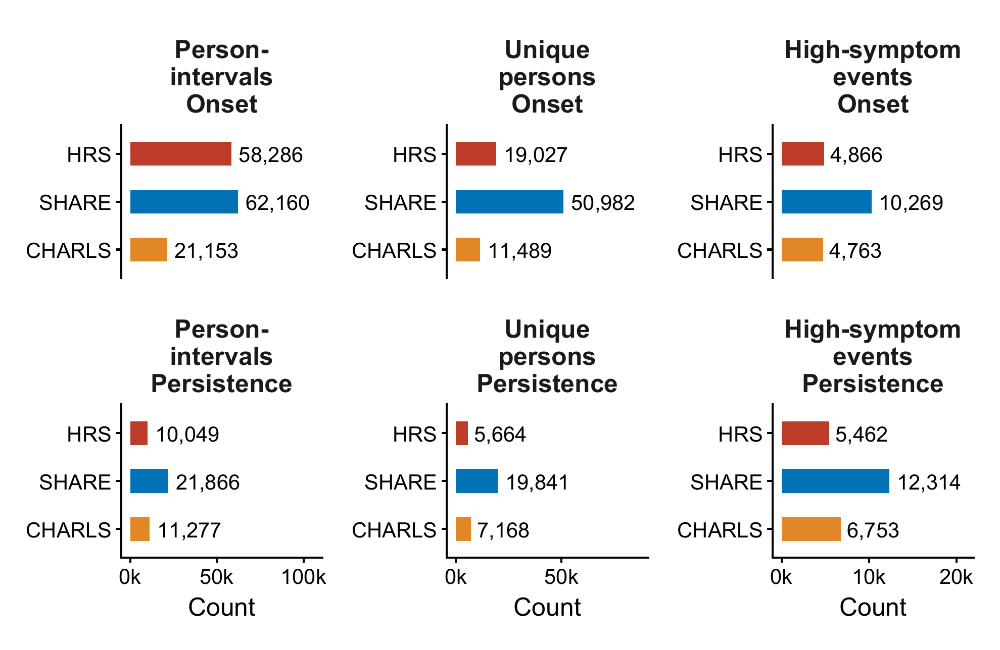
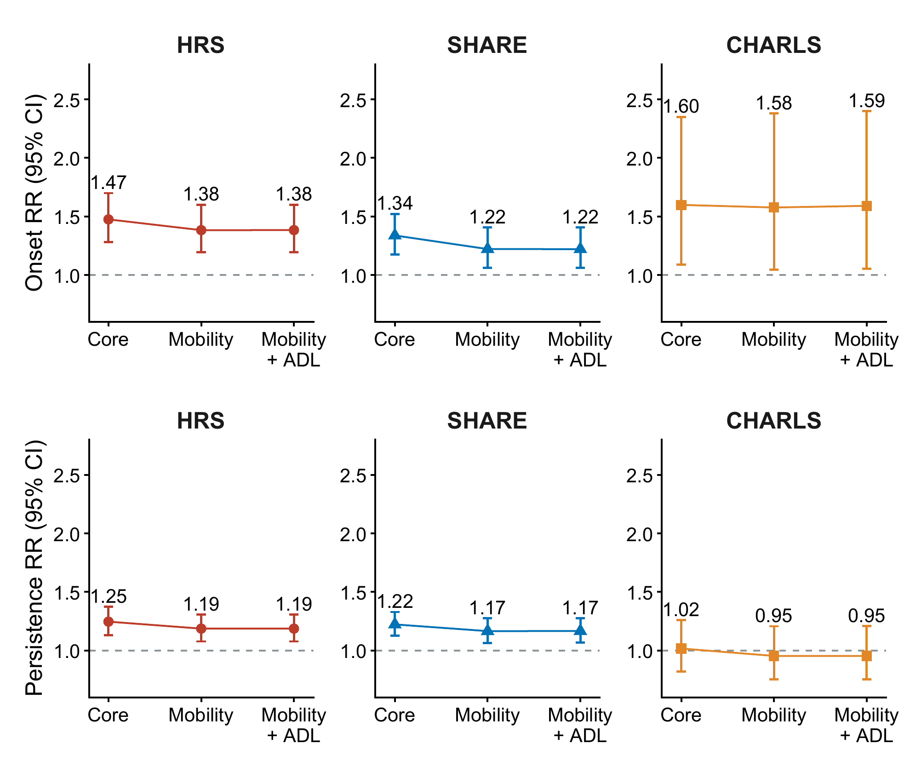
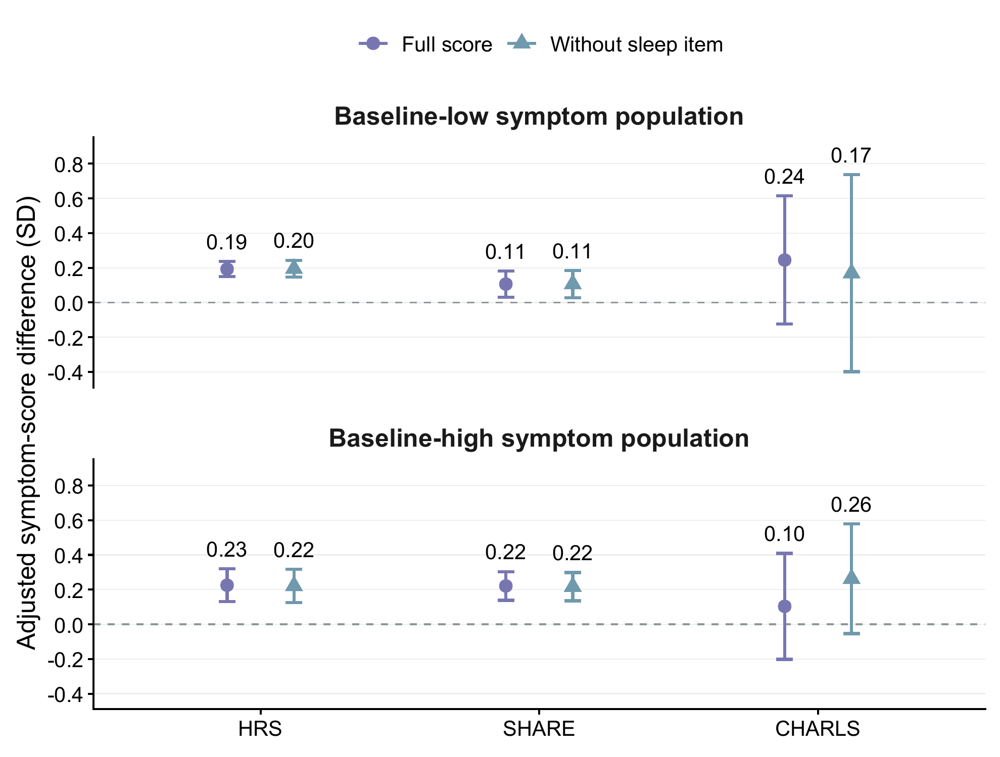
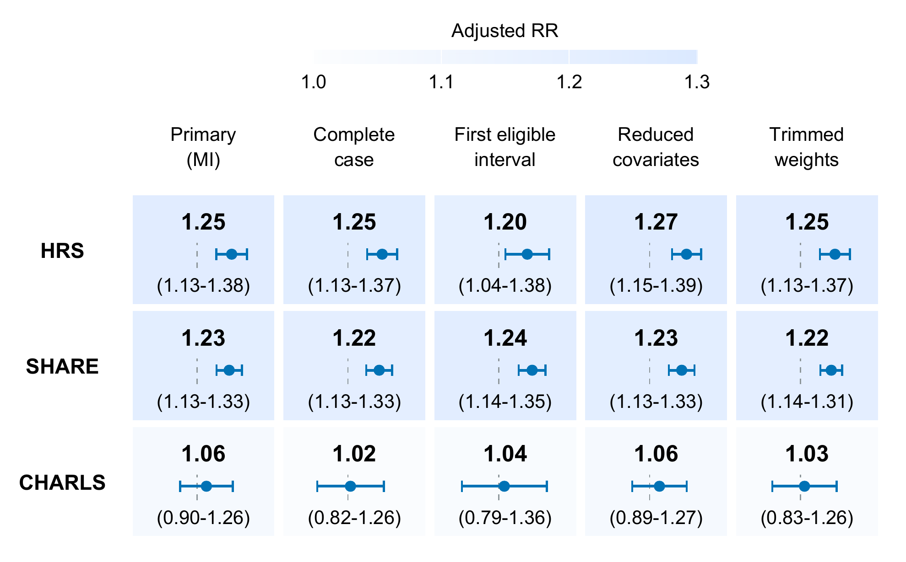

# Supplementary material

Table S1 and Figures S1–S4 reproduce the current manuscript supporting materials. Estimates are frozen summaries, not new analyses. Cohort samples, weights and missing-data handling differ between outcome definitions.

## Table S1 Pain only versus cancer only under two outcome definitions

| Cohort  | Symptom onset  | Symptom onset  | Symptom persistence  | Symptom persistence  |
| --- | --- | --- | --- | --- |
| Cohort  | High symptoms | Symptoms or death | High symptoms | Symptoms or death |
| HRS | 1.36 (1.16-1.60) | 0.94 (0.85-1.05) | 1.08 (0.94-1.25) | 0.98 (0.89-1.08) |
| SHARE | 1.09 (0.94-1.27) | 0.98 (0.87-1.12) | 1.09 (0.97-1.23) | 1.01 (0.92-1.10) |
| CHARLS | 2.16 (1.38-3.36) | 1.43 (1.05-1.97) | 1.59 (1.11-2.28) | 1.40 (1.02-1.91) |

Composite and symptom models differ in population, weights and missing-data handling. These are not isolated causal effects of survival selection.

Figure S1 Final symptom model populations

Unweighted person-intervals, unique persons and high-symptom events for each cohort and baseline symptom population. Horizontal scales differ by count type. A person may contribute multiple intervals and may enter different baseline symptom populations over time; unique-person counts must not be summed across onset and persistence. This is a model-population census, not a full eligibility or exclusion flow.

Figure S2 Sequential functional adjustment

Complete-case cancer-and-pain versus neither risk ratios and 95% confidence intervals. The top row shows onset and the bottom row persistence; columns show HRS, SHARE and CHARLS. Core covariate models were followed by additional mobility adjustment and then mobility plus activities-of-daily-living (ADL) adjustment. All panels use the same RR range. Samples may change as covariates are added. Connecting lines describe changes across model specifications, not longitudinal trajectories or causal mediation effects.

Figure S3 Continuous symptom scores with and without the sleep item

Complete-case adjusted differences in standardized follow-up depressive-symptom scores for cancer and pain versus neither, with 95% confidence intervals. The upper and lower rows represent baseline-low and baseline-high symptom populations, respectively; both outcomes are continuous scores, not threshold events. Circles represent the full score and triangles the score excluding the sleep item. Each analysis adjusts for its corresponding baseline score. Scales are standardized within cohort and score definition. The samples and score variances may differ between definitions; proximity of the estimates is not a paired equivalence test. Cohort estimates were not pooled. The wide CHARLS intervals retain the uncertainty of the existing analyses.

Figure S4 Persistence estimates across analysis specifications

Cancer-and-pain versus neither adjusted risk ratios and 95% confidence intervals for next-wave high symptoms among respondents with high baseline symptoms. Columns show the primary multiple-imputation model, complete-case core model, first eligible interval, reduced covariate model and final-weight trimming sensitivity. Each cell shows the RR, its 95% confidence interval and a mini-forest on the same logarithmic scale (RR 0.75-1.45). Dashed lines denote RR 1. Colour encodes the estimate, not statistical significance; intervals crossing one remain visible. Samples, covariates and missing-data handling differ between specifications. These are existing sensitivity estimates, not independent replications or new model fits. HRS extensions use the updated Final Core 2022 symptom endpoint; non-HRS extensions retain their frozen sources.
